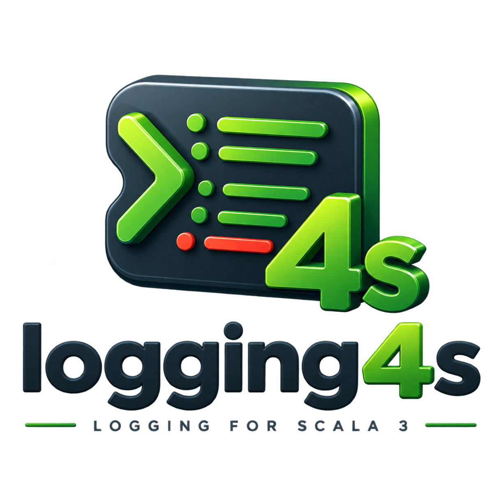
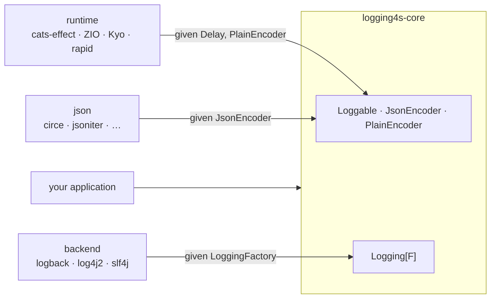

<p align="center">
  
</p>

# logging4s

Structured logging for Scala 3. You describe how your types render with a `Loggable[A]` type class, get a
`Logging[F[_]]` for your effect type, and log values directly. Each value is rendered to JSON and attached to the log
event as structured data; the message string carries a human-readable rendering of the same values.

[](https://github.com/logging4s/logging4s/actions/workflows/ci.yml)
[](https://central.sonatype.com/search?q=logging4s)
[](https://www.scala-lang.org/)
[](https://www.apache.org/licenses/LICENSE-2.0)

The library is a backend-agnostic `core` plus thin integration modules. The logging backend (logback / log4j2 / slf4j),
the effect type (`cats-effect` / ZIO / Kyo / rapid), and the JSON codec (circe / jsoniter / …) are independent modules,
each wired in through a `given` import. `core` has no dependency on any of them.



* [Quick start](#quick-start)
* [The `Loggable` type class](#the-loggable-type-class)
* [Logging](#logging)
* [Backends](#backends)
* [Configuration](#configuration)
* [Modules](#modules)
* [Benchmarks](#benchmarks)
* [Migration](#migration)
* [Adopters](#adopters)
* [Design notes](#design-notes)
* [Contributing](#contributing)

## Quick start

Pick a backend and an effect runtime (a JSON library is optional — `derives Loggable` needs none):

```scala
libraryDependencies ++= Seq(
  "org.logging4s" %% "logging4s-cats"    % "3.0.0",
  "org.logging4s" %% "logging4s-logback" % "3.0.0"
)
```

```scala
import cats.effect.{IO, IOApp}

import logging4s.core.{Loggable, Logging}
import logging4s.cats.CatsInstances.given        // Delay[IO], cats.Show/data bridges
import logging4s.logback.LogbackInstances.given  // the LoggingFactory

final case class User(id: Int, name: String) derives Loggable

object Main extends IOApp.Simple:
  def run: IO[Unit] =
    for
      log <- Logging.create[IO]("Main")
      _   <- log.info("user created", User(1, "John"))
    yield ()
```

The `logback` backend attaches `User` as a nested JSON object; the message string gets its plain rendering:

```json
{"message":"user created: user -> (id -> (1), name -> (John))","user":{"id":1,"name":"John"},"source":"Main.scala:12","level":"INFO"}
```

## The `Loggable` type class

Everything centers on one type class. A `Loggable[A]` is required for any value you log:

```scala
trait Loggable[A]:
  val key: ValueKey            // the field name the value logs under
  def json(a: A): JsonString   // structured form
  def plain(a: A): PlainString // human-readable form, appended to the message
```

`ValueKey`, `JsonString` and `PlainString` are opaque `String`s. There are four ways to obtain an instance — `derived`,
`fromEncoders`, `make`, and the field-policy builder `deriving`. Each infers the top-level key from the type name by
default, or takes an explicit key as its first argument — consistently across all four:

```scala
Loggable.derived[User]        // key "user"        Loggable.derived[User]("account")
Loggable.fromEncoders[User]   // key "user"        Loggable.fromEncoders[User]("account")
Loggable.make[User](…)        // key "user"        Loggable.make[User]("account")(…)
Loggable.deriving[User]       // key "user"        Loggable.deriving[User]("account")
```

### Derivation

`derives Loggable` (or `Loggable.derived`) builds both renderings structurally from the fields — each field type needs
its own `Loggable`, and the JSON object is assembled by the macro (no JSON library involved):

```scala
final case class Point(x: Int, y: Int) derives Loggable

enum Color derives Loggable:
  case Red, Green, Blue
```

Products render as objects keyed by field name (run through `keyNameStyle`); sum types delegate to the selected
variant, and a parameterless case renders as its label.

### From an existing codec

If you already have a JSON codec for `A`, `Loggable.fromEncoders` delegates `json` to it. The log JSON is then exactly
your codec's output — its field names, its escaping, untouched by our config. `plain` comes from a `PlainEncoder[A]`
(e.g. bridged from `cats.Show`) if one is in scope, otherwise a structural rendering:

```scala
import io.circe.Encoder
import io.circe.generic.semiauto.deriveEncoder
import logging4s.core.Loggable
import logging4s.json.circe.CirceInstances.given

final case class User(id: Int, name: String)
object User:
  given Encoder[User]  = deriveEncoder
  given Loggable[User] = Loggable.fromEncoders
```

Prefer this over `derives` when a codec exists: it delegates to the codec's writer instead of assembling strings, and
keeps the logged representation identical to the rest of your app. `derives` is for types that have no codec.

### By hand

Give the two renderings directly — `json` returns a `JsonString` (use `JsonString.quoted` to escape a string value, or
`JsonString(...)` for a raw JSON fragment), `plain` returns a `PlainString`:

```scala
import logging4s.core.{Loggable, JsonString, PlainString}

given Loggable[Money] =
  Loggable.make(m => JsonString(m.cents.toString), m => PlainString(s"$$${m.cents / 100.0}"))
```

### Adapting an existing instance

Derive a `Loggable` for a wrapper type from the underlying type's instance with `contramap` (optionally renaming the
key), or `redacted` to mask a type everywhere it is logged:

```scala
final case class UserId(value: Int)
given Loggable[UserId] = Loggable[Int].contramap(_.value, "user_id")

final case class Password(value: String)
given Loggable[Password] = Loggable[String].contramap(_.value, "password").redacted()  // always renders "***"
```

`redacted` masks the whole type wherever it appears; to mask a single field of a product, use `.mask` in the
[per-field builder](#per-field-policies).

### Per-field policies

For derived products, override individual fields with a builder. Selectors are macro-checked field references — not
strings, not annotations — so they survive refactors and work on types you don't own:

```scala
import logging4s.core.Loggable
import logging4s.core.deriving.MaskMode

final case class Account(id: Int, email: String, password: String, address: Address)
object Account:
  given Loggable[Account] =
    Loggable.deriving[Account]
      .hide(_.password)                    // omit
      .mask(_.email)(MaskMode.KeepLast(4)) // partial mask
      .rename(_.id, "account_id")          // custom key
      .unembed(_.address)                  // splice its fields into the parent object
      .derived
```

`unembed` flattens the JSON only; the plain rendering keeps the field nested.

## Logging

`Logging.create` returns `F[Logging[F]]`; the log methods return `F[Unit]`. There are `createTry` / `createEither` /
`createUnsafe` variants for non-effect code.

```scala
for
  log <- Logging.create[IO]("OrderService")
  _   <- log.info("service started")
  _   <- log.info("order placed", user, order)          // any number of values
  _   <- log.error("payment failed", throwable, order)  // with a cause
  scoped = log.withContextValues(requestId.asLogValue("request_id"))
  _   <- scoped.info("handled")                         // context attached to every line
yield ()
```

The passed message is joined with the `plain` rendering of the values, and each value is attached as structured data
for the backend to emit as fields. Every record also carries the call site as a `source` field.

Duplicate keys resolve by specificity: a call-site value overrides a context value with the same key, and a later
`withContext` overrides an earlier one. Only duplicates *within a single call* are suffixed (`k`, `k_2`), since those
are two values you deliberately passed.

An interpolator is available for terser call sites — import the log syntax and have a `given Logging[F]` in scope; the
key is taken from the interpolated identifier:

```scala
import logging4s.core.syntax.logging.*

info"order placed: $order"   // == log.info("order placed", order.asLogValue("order"))
```

Values render lazily, and the interpolator checks the level before it builds anything — a `debug"…"` under a logger set
to `INFO` evaluates neither the interpolated expressions nor their JSON. The check happens when the `F[Unit]` is
*constructed*, so a log action built once under a disabled level and run later stays suppressed; build and run it in the
same place (the usual `for` comprehension) and this never comes up.

Value-building helpers (`asLogValue`, `mapPlain`, `withKey`) are in `logging4s.core.syntax.loggable.*`;
`logging4s.core.syntax.all.*` brings both.

## Backends

`Loggable.json` produces a `JsonString`, but how that reaches the log output depends on the backend — this is the one
choice that materially affects the result:

| Backend | How structured values are emitted | Nested JSON? |
| --- | --- | --- |
| `logback` | logstash raw-JSON markers | **Yes** — objects/arrays come out as genuine nested JSON |
| `log4j2` | a `MapMessage` argument on the log call (no MDC) | **Yes** with `JsonTemplateLayout` in object mode — our `MapMessage` renders its values as raw JSON |
| `slf4j` | slf4j 2.x fluent `addKeyValue` | Depends on the provider you bind; typically strings |

The same `log.info("user created", User(1, "John"))` (with `User derives Loggable`) comes out as:

```jsonc
// logback (LogstashEncoder) and log4j2 (JsonTemplateLayout) — user is a nested object
{"message":"user created: user -> (id -> (1), name -> (John))","user":{"id":1,"name":"John"}}

// slf4j — the same value, escaped, because its key-value pairs are stringly-typed
{"message":"user created: user -> (id -> (1), name -> (John))","user":"{\"id\":1,\"name\":\"John\"}"}
```

The message string is identical; the difference is whether `user` is a queryable object or an opaque string. `logback`
(with `LogstashEncoder`) and `log4j2` (with `JsonTemplateLayout`) both emit it nested; `slf4j` can't. All three share
the same `Logging.create` API — you only swap the `import logging4s.<backend>.<Backend>Instances.given`.

<details>
<summary>How structured values reach each backend</summary>

`Loggable.json` produces a **pre-rendered JSON string**. To appear as a real nested object it must be spliced into the
output *raw* (not re-escaped as a string), which each backend handles differently:

* **logback** attaches values as logstash `appendRaw` markers; the `LogstashEncoder` splices them as raw JSON.
* **log4j2** puts them into a `MapMessage`. `MapMessage` is a `MultiformatMessage`, and we render its JSON form with
  raw values, so a `JsonTemplateLayout` `message` resolver in object mode (its default, `stringified: false`) splices
  them as real nested JSON — no custom resolver needed.
* **slf4j** hands them to `addKeyValue`; slf4j is only a facade, so rendering is up to whichever provider you bind, and
  its `KeyValuePair`s have no raw-JSON notion — expect escaped strings.

We never touch your `logback.xml` / `log4j2.xml`: values are only *attached* to the event and your encoder/layout
decides what to render. The nested-JSON guarantees assume a JSON layout (`LogstashEncoder` / `JsonTemplateLayout`) — a
plain `PatternLayout` prints the text message and ignores the structured attachment.

</details>

`logging4s-logback` also ships an opt-in `Logging4sEncoder` that writes the JSON itself — no `LogstashEncoder`
round-trip, no Jackson — smaller and faster for the fixed shape it emits (`@timestamp`, `level`, `logger`, `thread`,
`message`, your values as raw nested JSON, MDC, `stack_trace`). Point your appender at it in `logback.xml`:

```xml
<encoder class="logging4s.logback.Logging4sEncoder"/>
```

If you'd rather keep `LogstashEncoder` (or any other), nothing changes — the structured values are attached both ways.

### Standalone console

`logging4s-console` needs no logging framework at all — it writes structured JSON (or colored plain text) straight to
stdout/stderr, which fits containers and 12-factor apps. It's configured via HOCON under `logging4s.console` — override
it in your `application.conf`, or with `LOGGING4S_CONSOLE_*` environment variables:

```hocon
logging4s.console {
  level  = "info"    # error | warn | info | debug | trace
  format = "json"    # json | plain
  color  = "auto"    # auto (TTY only) | on | off   — plain format
  stream = "stdout"  # stdout | stderr
  max-stack-trace-lines = -1   # -1 keeps the full trace

  # per-logger thresholds: exact name or dot-segment prefix, most specific wins
  levels {
    "io.netty"       = "warn"
    com.acme.Service = "debug"
  }
}
```

```scala
import logging4s.console.ConsoleInstances.given

val log = Logging.create[IO]("Main")   // structured JSON to stdout, no logback.xml
```

## Configuration

Rendering is controlled by a single `LoggableEncodingConfig` (`logging4s.core.config`). A default `given` is provided;
override it once, application-wide:

```scala
import logging4s.core.config.*

given LoggableEncodingConfig =
  LoggableEncodingConfig(
    keyNameStyle     = KeyNameStyle.CamelCase,
    plainValuesStyle = PlainValuesStyle.Logfmt
  )
```

| Field | Default | Effect |
| --- | --- | --- |
| `jsonTupleAsArray` | `true` | tuple/`Map`/`Ior` JSON: `true` → `[1,"a"]`, `false` → `{"int":1,"string":"a"}` |
| `keyNameStyle` | `SnakeCase` | applied to every key: `AsIs` / `SnakeCase` / `KebabCase` / `CamelCase` / `PascalCase` |
| `plainTupleStyle` | `AsScala` | tuple plain form: `(1, a)` / `[1, a]` / `1, a` / `{1, a}` |
| `plainValuesStyle` | `Arrow` | value-list join: `Arrow` `k -> (v)`, `Logfmt` `k=v`, `Colon` `k: v`, `CurlyMap` `{k=v}`, … |
| `includeSourcePosition` | `true` | attach the call site as a `source` field (`"OrderService.scala:42"`) |

`keyNameStyle` and `plainValuesStyle` are applied by the backend at aggregation time; `jsonTupleAsArray` and
`plainTupleStyle` are baked into compound `Loggable`s when they are summoned. A single top-level `given` covers both.

Default keys: scalars key by type name (`Loggable[Int]` → `int`), date/time types use `time` (`LocalDate` uses `date`),
`FiniteDuration` and `java.time.Duration` use `time_ms`, `Throwable` uses `error`, collections append a plural suffix
(`List[Int]` → `ints`), and a derived case class keys by its decapitalized name (`User` → `user`).

## Modules

Published for Scala 3 under `org.logging4s`:

```scala
"org.logging4s" %% "logging4s-<module>" % "3.0.0"
```

| | Module | Min. Scala | Notes |
| --- | --- | --- | --- |
| core | `logging4s-core` | 3.3 LTS | type classes + `Logging`; no backend dependency |
| backend | `logging4s-logback` | 3.3 LTS | slf4j + logback + logstash-encoder; real nested JSON |
| | `logging4s-log4j2` | 3.3 LTS | Log4j2 API; values as a `MapMessage` |
| | `logging4s-slf4j` | 3.3 LTS | bare slf4j-api 2.x `addKeyValue`; bring your own binding |
| | `logging4s-console` | 3.3 LTS | standalone JSON/plain to stdout/stderr; HOCON-configured; no logging framework needed |
| runtime | `logging4s-cats` | 3.3 LTS | `cats-effect 3`; plain via `cats.Show` |
| | `logging4s-zio` | 3.3 LTS | `zio.Task`; plain via `zio.prelude.Debug` |
| | `logging4s-kyo` | **3.8** | `kyo.Sync`; plain via `kyo.Render` |
| | `logging4s-rapid` | **3.8** | `rapid.Task` |
| json | `logging4s-circe` | 3.3 LTS | `io.circe.Encoder` |
| | `logging4s-jsoniter` | 3.3 LTS | `jsoniter-scala JsonValueCodec` |
| | `logging4s-zio-json` | 3.3 LTS | `zio-json JsonEncoder` |
| | `logging4s-play-json` | 3.3 LTS | `play-json Writes` |
| | `logging4s-spray-json` | 3.3 LTS | `spray-json JsonWriter` |
| | `logging4s-json4s` | 3.3 LTS | `json4s Formats` |
| | `logging4s-argonaut` | 3.3 LTS | `argonaut EncodeJson` |
| | `logging4s-borer` | 3.3 LTS | `borer Encoder` |
| | `logging4s-upickle` | 3.3 LTS | `upickle Writer` |
| | `logging4s-weepickle` | 3.3 LTS | `weepickle From` |
| | `logging4s-fabric` | 3.3 LTS | `fabric Json` |

### Compatibility

`Scala 3` TASTy is backward but not forward compatible, so the two modules built on `3.8` above **cannot be consumed
from a Scala `3.3 LTS` project**, even though every other module can. They are pinned there because kyo and rapid
themselves require it — nothing in logging4s does. Everything else, `logging4s-core` included, stays on `3.3 LTS` and
is usable from both.

In practice: if your application is on `3.3 LTS`, pick any backend and any JSON module freely, and use the `cats` or
`zio` runtime. Reaching for `logging4s-kyo` or `logging4s-rapid` means moving the whole application to `3.8`.

From 3.0.0 onward, binary compatibility within a major version is checked by
[MiMa](https://github.com/lightbend/mima) on every build, and `versionScheme := "semver-spec"` describes what the
artifacts promise.

`logging4s-kyo` depends on a kyo release candidate (`1.0.0-RC6`). Until kyo reaches `1.0.0` final, that module sits
outside the binary-compatibility promise the other artifacts make. Compiling it also needs **JDK 25** — kyo's `Frame`
macro runs inside the compiler and its class files target Java 25, so this is a compile-time requirement, not just a
runtime one.

Each integration module exposes its `given`s as a named trait plus a companion object, so you can also mix several into
one import for your app:

```scala
object instances extends LogbackInstances with CatsInstances with CirceInstances
```

## Benchmarks

A JMH harness in [`benchmarks/`](benchmarks) logs the same mid-size event (eight fields — every scalar type, a list, and
one nested object) through each backend, routed to a discarding sink so only CPU cost is measured. Structured values are
built with the same jsoniter codec everywhere, except the two `console` rows, which contrast the two derivation paths.

Every row is logging4s itself, wired to a different backend/encoder — this compares **our own backend choices against
each other**, not logging4s against other logging libraries (there is no third-party baseline here).

```bash
sbt "benchmarks/Jmh/run -f 1 -wi 5 -i 12 .*BackendsBench.*"
```

Measured as **throughput — operations per second, higher is better** (single fork, one developer machine — rough
ballpark, not authoritative; run it on your own hardware):

| Config | ops/s |
| --- | ---: |
| `log4j2` + `JsonTemplateLayout` (nested) | ~330k |
| `log4j2` (stringified message) | ~210k |
| `console` + `fromEncoders` (jsoniter) | ~200k |
| `logback` + `Logging4sEncoder` | ~170k |
| `logback` + `LogstashEncoder` | ~140k |
| `console` + `derives` | ~120k |

> These numbers are **rough**: a single fork on a loaded developer laptop, with wide error bars (±50% on some rows) and
> up to ~2× run-to-run swing. Read them as orders of magnitude, not a precise ranking — the middle configs overlap.

Takeaways:

* Throughput spans roughly ~120k–330k ops/s. `log4j2` with `JsonTemplateLayout` leads; `console` + `derives` trails.
* The **encoding path matters as much as the backend**: on the same `console` backend, `fromEncoders` with a codec
  (~200k) is ~1.7× the throughput of `derives` (~120k), which assembles both JSON and plain from `Mirror`.
* `Logging4sEncoder` (~170k) edges ahead of `LogstashEncoder` (~140k) — it builds the JSON in a single pass, straight
  from the event, with no Jackson round-trip. The two are close enough to overlap in noise, so the real win from owning
  the encoder is control and dropping Jackson, with throughput on par or slightly better.

### The disabled-level path

A second harness measures what a *suppressed* record costs — a `debug` call under a logger set to `INFO`:

```bash
sbt "benchmarks/Jmh/run -f 1 .*LevelGateBench.*"
```

| Call shape | ops/s |
| --- | ---: |
| interpolator, level off (`debug"event $e"`) | ~791M |
| direct call with a lazy value, level off | ~387M |
| direct call with a pre-rendered value, level off (2.x behaviour) | ~1.5M |
| interpolator, level on | ~409k |
| direct call, level on | ~406k |

In 2.x a suppressed `debug` still rendered every value to JSON at the call site, so it cost roughly a quarter of an
actual log write. In 3.0 values render lazily (~250× cheaper) and the interpolator additionally skips the call entirely
when the level is off (another ~2×). With the level *on*, the guard costs nothing measurable.

> The two disabled rows are JIT-optimistic in absolute terms: with nothing escaping, escape analysis removes the
> wrapper allocations outright, so ~1.3 ns/op is a floor rather than a field measurement. The orders of magnitude and
> the ordering are the signal; the enabled rows are ordinary measured work.

## Migration

### From 2.x to 3.0

3.0 is a breaking release. Everyday call sites — `Logging.create`, the per-level methods, `withContext`, the
`*Instances.given` imports — are unchanged; the breaks are in what you *implement* and in the shape of the output.

**1. Bump the version.** Coordinates are otherwise identical:

```diff
- "org.logging4s" %% "logging4s-cats" % "2.0.1"
+ "org.logging4s" %% "logging4s-cats" % "3.0.0"
```

**2. `Logging[F]` now has three abstract members instead of twenty.** If you implement `Logging` yourself (a custom
backend, or a test double), implement `emit` / `enabled` / `unit`; the twenty per-level overloads became `final` and
forward to `emit`:

```scala
def emit(level: Level, message: String, cause: Option[Throwable], values: Seq[LoggableValue])(using Position): F[Unit]
def enabled(level: Level): Boolean
def unit: F[Unit]
```

**3. `Level` moved to `logging4s.core`.** It used to live in `logging4s.console`:

```diff
- import logging4s.console.Level
+ import logging4s.core.Level
```

**4. `LoggableValue` is a `sealed trait`, and values render lazily.** `LoggableValue(key, plain, json)` still builds a
pre-rendered value, but `asLogValue` and friends now defer rendering until the backend reads it. It is no longer a
`case class`: `copy` and pattern matching on it are gone — use `withKey` to rewrite a key.

**5. `None` and `Unit` render as JSON `null`.** They used to render as an empty string, which produced invalid JSON
(`{"nick":}`). If anything downstream parsed that, it can now parse it.

**6. Log records carry a `source` field.** Every record gets `source = "File.scala:42"`. Turn it off with
`LoggableEncodingConfig(includeSourcePosition = false)`.

**7. Context values merge by key instead of being suffixed.** A later `withContext` overrides an earlier one with the
same key, and a call-site value overrides the context. Duplicates *within one call* are still suffixed (`k`, `k_2`).

**8. `log4j2` `LoggableMapMessage` takes `Seq[(String, String)]`** instead of `Map`, so field order follows the call
site.

### New in 3.0 (optional — pick these up while you're here)

- **Call-site capture** — every record carries `source = "OrderService.scala:42"`.
- **Level gating in the interpolator** — `debug"..."` builds nothing at all when the level is off (see Benchmarks).
- **`Loggable` for `Throwable`** (and any subtype), `LocalDate` / `LocalTime` / `OffsetDateTime` /
  `java.time.Duration`, and `Array[T]` — so `error"request failed $ex"` now compiles.
- **`Logging.mapK`** — lift a `Logging[F]` into another effect with `[A] => F[A] => G[A]`.
- **Per-logger levels for the console backend** — `logging4s.console.levels { "io.netty" = "warn" }`.
- **`Loggable.mapPlain`** — a fourth combinator alongside `rename` / `contramap` / `redacted`.

### From 1.x to 2.0

2.0.0 is a breaking release, but most call sites need only small edits — `Logging.create`, the `*Instances.given`
imports, `LoggingContext`, and the per-level methods are all source-compatible.

**1. Bump the version.** Coordinates are otherwise identical:

```diff
- "org.logging4s" %% "logging4s-cats" % "1.0.1"
+ "org.logging4s" %% "logging4s-cats" % "2.0.0"
```

**2. `syntax` is now a package — add `.all`.** The extension methods (`asLogValue`, `withKey`, `Seq.plain`) sit behind
an aggregator object:

```diff
- import logging4s.core.syntax.*
+ import logging4s.core.syntax.all.*
```

(or the granular `syntax.loggable.*` / `syntax.logging.*`).

**3. The single `make` split into four purpose-specific constructors.** In 1.x every instance was built with
`Loggable.make`. 2.0 replaces it with four constructors — pick by where the two renderings come from:

| 1.x | 2.0 | Use when |
| --- | --- | --- |
| `make[A: JsonEncoder: PlainEncoder]("k")` | `Loggable.fromEncoders[A]` (or `[A]("k")`) | You have a JSON codec (circe / jsoniter / …) — `json` is the codec's own output. |
| _n/a_ | `derives Loggable` / `Loggable.derived[A]` (or `[A]("k")`) | No codec — the JSON is assembled structurally by the macro. |
| _n/a_ | `Loggable.deriving[A]….derived` | Derived, but with per-field policies (`hide` / `mask` / `rename` / `unembed`). |
| `make[A]("k")(encode, show)` | `Loggable.make[A](json, plain)` (or `[A]("k")(json, plain)`) | Fully manual — you write both renderings by hand. |

Two concrete edits:

```scala
// 1.x — codec-backed make
given Loggable[User] = Loggable.make("user")   // required a JsonEncoder + PlainEncoder
// 2.0 — that is exactly fromEncoders
given Loggable[User] = Loggable.fromEncoders    // key "user" from the type name; or fromEncoders("user")

// 1.x — manual make, functions returned String
given Loggable[Money] = Loggable.make("money")(m => m.cents.toString, m => s"$$${m.cents / 100.0}")
// 2.0 — same shape, functions now return the opaque JsonString / PlainString
given Loggable[Money] = Loggable.make(m => JsonString(m.cents.toString), m => PlainString(s"$$${m.cents / 100.0}"))
```

Every constructor takes the key as an optional first argument, or infers it from the type name — consistently across
all four.

**4. Hand-written instances return opaque types.** If you implement `Loggable` (or `JsonEncoder` / `PlainEncoder`) by
hand, `key` / `json` / `plain` return `ValueKey` / `JsonString` / `PlainString` instead of raw `String` — wrap the
values (`ValueKey(...)`, `JsonString.quoted(...)`, `PlainString(...)`). Also `rename` / `contramap` / `redacted` are now
`final`; if you overrode them, compose instead (3.0 adds `mapPlain` to the same set).

#### New in 2.0

- **`derives Loggable`** — structural derivation, no JSON library required.
- **Field policies** — `Loggable.deriving[A].hide(_.password).mask(_.email)(MaskMode.KeepLast(4)).rename(_.id, "account_id").unembed(_.address).derived`.
- **Log interpolator** — `info"user created: $user"`.
- **App-wide `LoggableEncodingConfig`** — key-name style, tuple / collection rendering.
- **New backends** — standalone `logging4s-console`; opt-in `Logging4sEncoder` for logback (nested JSON, no Jackson);
  nested JSON for log4j2 via `JsonTemplateLayout`.

## Adopters

<a href="https://betby.com">
  <picture>
    <source media="(prefers-color-scheme: dark)" srcset="logos/betby.svg"/>
    
  </picture>
</a>

Using logging4s? Open a PR to add your logo.

## Design notes

* **Scala 3 only.** The API is `given`-based; derivation uses `Mirror` and inline, with no runtime reflection.
* **`derives` vs `fromEncoders`.** `derives` assembles JSON itself (string building; useful when no codec exists);
  `fromEncoders` delegates to your codec (faster, and the log JSON matches your wire JSON). Both coexist per type.
* **Lazy values, eager keys.** A `LoggableValue` holds the value and its `Loggable` and renders on first read, so a
  suppressed record pays for neither representation. Keys are known up front, which is what lets merging, deduplication
  and key-name normalization run without forcing anything.
* **Custom backends.** Implement `emit` / `enabled` / `unit` — the twenty per-level methods are `final` and forward to
  `emit`. `LoggingFactory`, `Delay`, `Position`, `LogMessage.render`, and `LoggableValue.normalizeKeys` /
  `deduplicateKeys` / `mergeByKey` / `withSource` are the public SPI for a backend that isn't shipped here.

## Contributing

Bug reports and PRs are welcome. See [CONTRIBUTING.md](CONTRIBUTING.md) for how to build the project,
run its tests, and where to make changes for common kinds of contributions. This project follows the
[Contributor Covenant](CODE_OF_CONDUCT.md); please report security issues per [SECURITY.md](SECURITY.md)
rather than in a public issue.

## License

Apache 2.0 — see [LICENSE](LICENSE).
