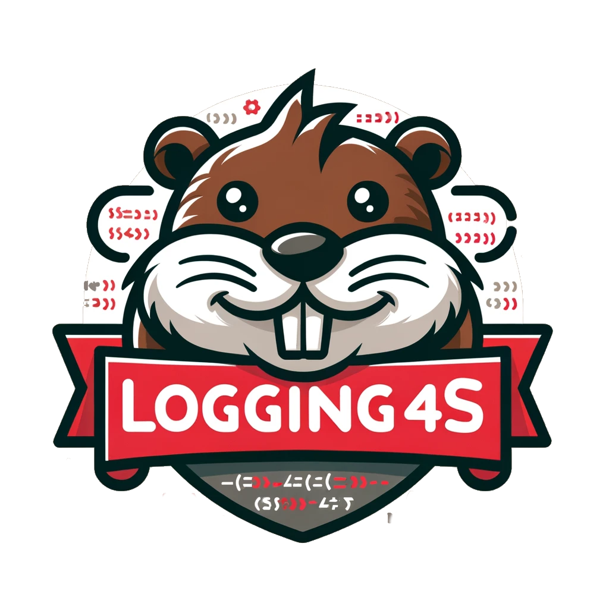

## Logging4s



`Logging4s` is small logging library for structured (json) logs. The `core` module is backend-agnostic (just type classes
and the `Logging` interface) - the concrete implementation lives in a separate backend module. Pick one:

* `logging4s-logback` - `Logging` on top of `slf4j` via `logback` and `logstash-encoder`. Structured values are attached as
  real JSON fields via logstash's raw-JSON markers - the only backend that gives nested objects/arrays as genuine JSON
  rather than an escaped string.
* `logging4s-log4j2` - `Logging` directly on Log4j2's own API (not via slf4j). Structured values are passed as a
  `MapMessage` argument to the log call itself (like logback passes a `Marker`) - no `ThreadContext`/MDC involved, so
  no thread-locality concerns and no risk of clobbering a pre-existing MDC entry with the same key. Even with
  `JsonTemplateLayout` configured in your `log4j2.xml`, values are still plain `String` entries in the map, so a
  `Loggable` that renders a nested object or array will come out double-encoded unless your layout knows how to treat
  a specific field as raw JSON.
* `logging4s-slf4j` - `Logging` on bare `slf4j-api` 2.x, using its native fluent `addKeyValue` builder. No backend is
  bundled - bring your own slf4j binding. **Weakest guarantee**: `addKeyValue`'s value is serialized like any other
  object, so structured values are escaped as JSON strings too (confirmed even against a modern logstash-encoder), and
  whether they show up at all depends on the slf4j provider/version you plug in.

All three backends expose the same `Logging.create`/`createTry`/`createEither`/`createUnsafe` from `logging4s.core.Logging` -
you just bring a `given LoggingFactory` into scope by importing `logging4s.<backend>.instances.given` for whichever
backend module you depend on. No per-backend helper object to remember.

### Quick start

#### Modules

* `logging4s-core` - type classes for abstract encoding and the `Logging` interface itself, independent of any concrete backend.
* `logging4s-logback` - backend implementation: `Logging` on top of `slf4j` via `logback` and `logstash-encoder`, with support for Try, Either and unsafe variants.
* `logging4s-log4j2` - backend implementation: `Logging` on top of Log4j2's own API, structured values via `ThreadContext`.
* `logging4s-slf4j` - backend implementation: `Logging` on bare `slf4j-api` using its native `addKeyValue` fluent API.
* `logging4s-cats` - implementation for `cats` and `cats-effect`
    * `logging4s-cats-core` - implementation for `PlainEncoder` via `cats.Show`
    * `logging4s-ce-2` - implementation for `cats-effect 2` `Sync`
    * `logging4s-ce-3` - implementation for `cats-effect 3` `Sync`
* `logging4s-zio` - implementation on top of `zio.Task` for runtime and `zio.prelude.Debug` for plain logs.
* `logging4s-kyo` - implementation `kyo.IO` for effect and `kyo.Render` for plain logs.
* `logging4s-json` - implementation json logs for different libs
    * `logging4s-circe` - implementation for `circe.Encoder`
    * `logging4s-jsoniter` - implementation for `jsoneter-scala JsonValueCodec`
    * `logging4s-argonaut` - implementation for `argonaut EncodeJson`
    * `logging4s-borer` - implementation for `borer Encoder`
    * `logging4s-play-json` - implementation for `play-json Writes`
    * `logging4s-json4s` - implementation for `json4s Formats`
    * `logging4s-spray-json` - implementation for `spray-json JsonWriter`
    * `logging4s-upickle` - implementation for `upickle Writer`
    * `logging4s-weepickle` - implementation for `weepickle From`
    * `logging4s-zio-json` - implementation for `zio-json JsonEncoder`

#### Example

Let's say you are using `cats-effect 3` and `circe`.

Plug the library in for sbt
```scala
libraryDependencies ++= Seq(
  "org.logging4s" %% "logging4s-ce-3" % version,
  "org.logging4s" %% "logging4s-circe" % version,
  "org.logging4s" %% "logging4s-logback" % version
)
```

Create `Loggable` implementation for your domain objects, create `Logging` instance and log your objects.

```scala
// Your domain
import java.util.UUID
import cats.Show
import io.circe.Encoder
import io.circe.generic.semiauto.deriveEncoder
import logging4s.core.Loggable

import logging4s.cats.instances.given
import logging4s.json.circe.instances.given

final case class User(id: UUID, name: String, age: Int)

object User:
  given Show[User]     = user => s"id=${user.id}, name=${user.name}, age=${user.age}"
  given Encoder[User]  = deriveEncoder
  given Loggable[User] = Loggable.make("user")


// Your program
import java.util.UUID
import cats.effect.std.UUIDGen
import cats.effect.{ExitCode, IO, IOApp}
import logging4s.cats.LoggingCats

import logging4s.core.LoggingContext
import logging4s.core.syntax.withKey

import logging4s.cats.instances.given
import logging4s.json.circe.instances.given
import logging4s.logback.instances.given // pick your backend by importing its `given LoggingBackend`

object CatsEffect3Example extends IOApp:

  private def createUser(name: String, age: Int): IO[User] =
    for id <- UUIDGen.randomUUID[IO]
    yield User(id, name, age)

  override def run(args: List[String]): IO[ExitCode] =
    for
      context <- IO.randomUUID.map(uuid => LoggingContext(uuid.withKey("session_id")))
      logging <- LoggingCats.create[IO]("CatsEffect3Example", context)

      johnShow <- createUser("John Show", 22)
      _        <- logging.info("User created", johnShow)
    
      daenerys <- createUser("Daenerys Targaryen", 22)
      _        <- logging.info("User created", daenerys)
    
      _ <- logging.info("All users created", Seq(johnShow, daenerys))
    yield ExitCode.Success
    
```

This will output:
```json
{"@timestamp":"2023-01-30T13:42:13.249+03:00","message":"User created: session_id -> (9602ed80-e54b-4e0a-8b9c-64762d28d05e), user -> (id=5db8c5e2-6275-437a-bca8-1ad8cd84fbd8, name=John Show, age=22)","name":"CatsEffect3Example","level":"INFO","user":{"id":"5db8c5e2-6275-437a-bca8-1ad8cd84fbd8","name":"John Show","age":22}}
{"@timestamp":"2023-01-30T13:42:13.249+03:00","message":"User created: session_id -> (9602ed80-e54b-4e0a-8b9c-64762d28d05e), user -> (id=c5e4bd53-abd8-4922-bcd2-5e40322e6b9b, name=Daenerys Targaryen, age=22)","name":"CatsEffect3Example","level":"INFO","user":{"id":"c5e4bd53-abd8-4922-bcd2-5e40322e6b9b","name":"Daenerys Targaryen","age":22}}
{"@timestamp":"2023-01-30T13:42:13.249+03:00","message":"All users created: session_id -> (9602ed80-e54b-4e0a-8b9c-64762d28d05e), users -> ([id=5db8c5e2-6275-437a-bca8-1ad8cd84fbd8, name=John Show, age=22,id=c5e4bd53-abd8-4922-bcd2-5e40322e6b9b, name=Daenerys Targaryen, age=22])","name":"CatsEffect3Example","level":"INFO","users":[{"id":"5db8c5e2-6275-437a-bca8-1ad8cd84fbd8","name":"John Show","age":22},{"id":"c5e4bd53-abd8-4922-bcd2-5e40322e6b9b","name":"Daenerys Targaryen","age":22}]}

```

In the `logback.xml` file, you can configure the output of logs as you need.

See `./examples` for more examples.

### Motivation

Have a library for structured logging that supports `Scala 3` and various implementations of `effects` and `json` libraries
cause `izumi logstage` and `tofu-logging` still not ported for new scala.